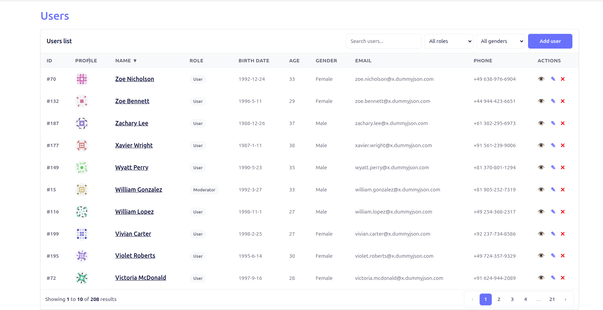
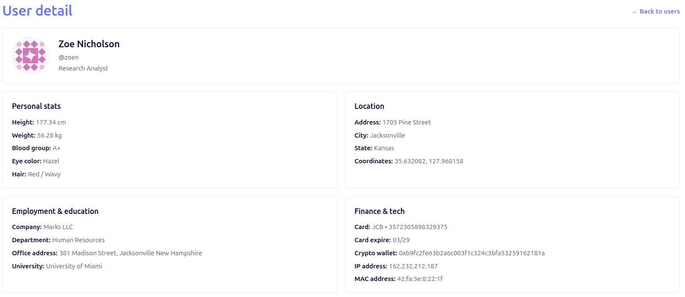
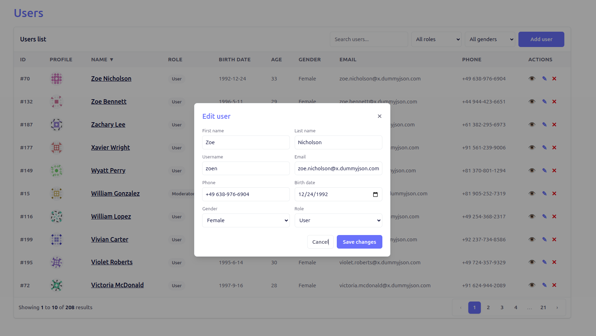
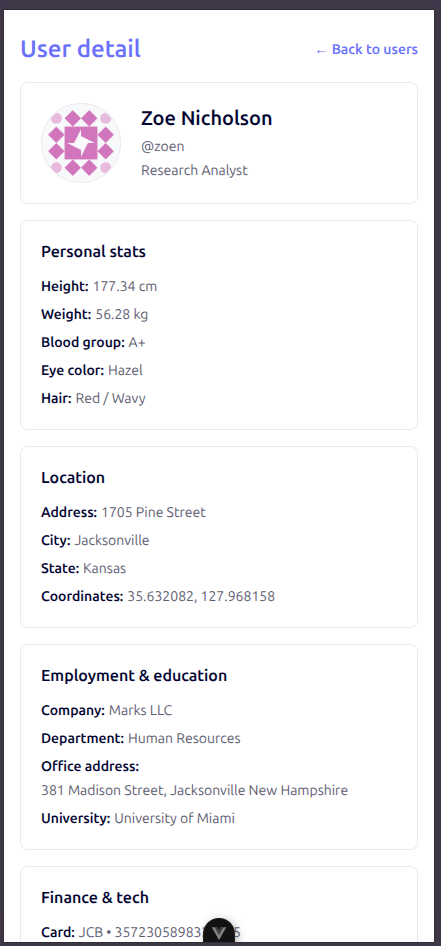
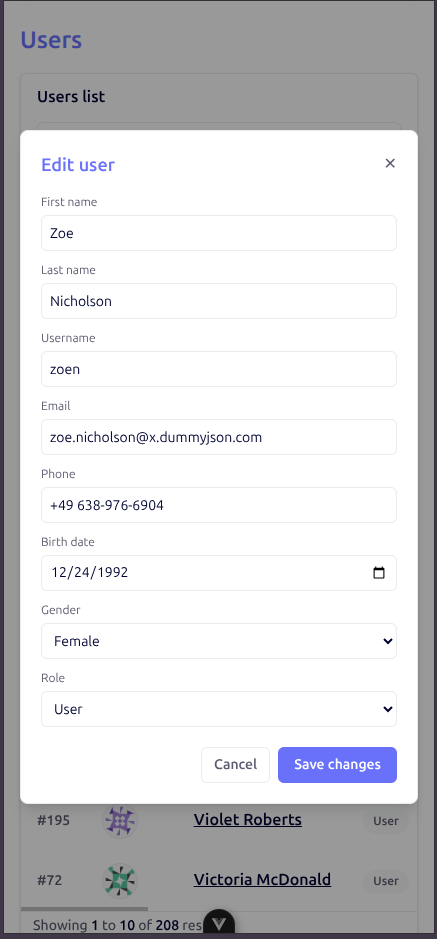

# Work for Impact

## Setup Instructions

Minimum Node version: 20.19.0 (or 22.12.0+).

If you use nvm:

```sh
nvm use
```

```sh
npm install
npm run dev
```
```sh
npm run lint
npm run format
```

## Brief Description

Vue 3 + Vite + Pinia app that consumes the DummyJSON Users API. It provides:
- User list with search, sort, filters, pagination, and CRUD simulation (local only).
- User detail page with data grouped into readable sections.
- Responsive layout for desktop and mobile.

## Async Data, Filtering, Sorting, Pagination

- **Async data**: Data is fetched via a service layer (`src/services/usersApi.js`) and stored in Pinia (`src/stores/users.js`). Loading/error states are tracked in the store.
- **Pagination**: Server-side using `limit` + `skip` in API requests. The UI is wired to `page` state and updates `skip` accordingly.
- **Sorting**: Server-side using `sortBy` + `order`. Clickable table headers update `sortKey` and `sortDir`, which are passed to the API.
- **Search**: Server-side using `/users/search?q=...` with a debounce in the list view.
- **Role/Gender filters**: Applied client-side on the current API page because the API does not support combining `/users/search` with `/users/filter` in one request. When both filters are cleared, the list refetches from the API to restore totals.

## Requirements Not Met

- None. All requirements are covered.  
- Note: Role/Gender filtering is client-side due to API limitations (search + filter cannot be combined).

## Bonus Points Implemented

- Linter setup
- Animations (row add/remove + update highlight)
- Form validation (native HTML validation + DOB max date)
- Optimistic UI updates (local create/edit/delete)

## Screenshots

### Desktop




### Mobile



